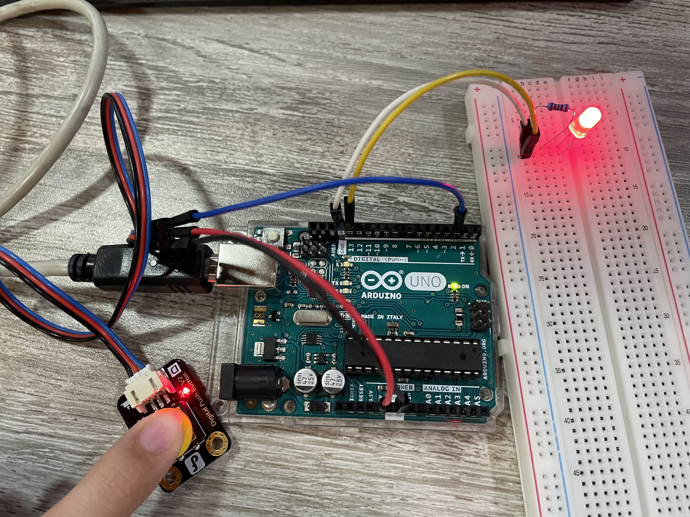

# INTERFAZII
### Ejercicio n°1 Arduino "hola Mundo"

```js
void setup() {
  Serial.begin(9600); // Inicia la comunicación serie a 9600 bps
  Serial.println("Hola, scuichi!"); // Envía "Hola, Mundo!" al monitor serie
}

void loop() {
  // No es necesario poner nada en el loop para este ejemplo
}
```

#### ejercicio n°2 LED Interminente (Blink)
```js
void setup() {
  pinMode(9, OUTPUT);  // Pin PWM (símbolo ~)
}
void loop() {
  int valor = analogRead(A0);           // Leer potenciómetro (0-1023)
  int brillo = map(valor, 0, 1023, 0, 255);  // Convertir a rango PWM
  analogWrite(9, brillo);               // Ajustar brillo
}
```


#### ejercicio n°3 LED Pulsador 

```js
void setup() {
  pinMode(2, INPUT);  // Botón como entrada
  pinMode(13, OUTPUT);
}
void loop() {
  if (digitalRead(2) == HIGH) {  // Si se presiona el botón
    digitalWrite(13, HIGH);
  } else {
    digitalWrite(13, LOW);
  }
}
void setup() {  // Configuración inicial (ej: pines como entrada/salida)
  pinMode(13, OUTPUT);  // Pin 13 como salida
  pinMode(8, OUTPUT);

  ```
}


  


#### ejercicio n°4 LED Intermitente 
```js
void loop() {   // Se repite infinitamente
  digitalWrite(13, HIGH);  // Encender LED
  delay(1000);             // Esperar 1 segundo
  digitalWrite(13, LOW);   // Apagar LED
  delay(1000);             // Esperar 1 segundo

 
  digitalWrite(8,HIGH);
  delay(1000);
  digitalWrite(8, LOW);
  delay(1000);
```

}


### ejercicio n°5 semáforo en Arduino.

```js
// C++ code - Semáforo Autos y Peatones

  digitalWrite(LED_5, HIGH);  // Rojo peatones encendido
// Definición de pines
int LED_1 = 6;  // Luz roja autos
int LED_2 = 7;  // Luz amarilla autos
int LED_3 = 8;  // Luz verde autos
int LED_4 = 9;  // Luz verde peatones
int LED_5 = 10; // Luz roja peatones

void setup() {
  // Configuramos todos los pines como salida
  pinMode(LED_1, OUTPUT);
  pinMode(LED_2, OUTPUT);
  pinMode(LED_3, OUTPUT);
  pinMode(LED_4, OUTPUT);
  pinMode(LED_5, OUTPUT);
}

void loop() {
  // 🚦 Fase 1: Autos en verde, peatones en rojo
  digitalWrite(LED_1, LOW);   // Rojo autos apagado
  digitalWrite(LED_2, LOW);   // Amarillo autos apagado
  digitalWrite(LED_3, HIGH);  // Verde autos encendido
  digitalWrite(LED_4, LOW);   // Verde peatones apagado
  digitalWrite(LED_5, HIGH);  // Rojo peatones encendido
  delay(5000); // 5 segundos

  // 🚦 Fase 2: Amarillo autos, peatones siguen en rojo
  digitalWrite(LED_3, LOW);   // Verde autos apagado
  digitalWrite(LED_2, HIGH);  // Amarillo autos encendido
  delay(2000); // 2 segundos
  digitalWrite(LED_2, LOW);   // Amarillo autos apagado

  // 🚦 Fase 3: Rojo autos, verde peatones
  digitalWrite(LED_1, HIGH);  // Rojo autos encendido
  digitalWrite(LED_5, LOW);   // Rojo peatones apagado
  digitalWrite(LED_4, HIGH);  // Verde peatones encendido
  delay(5000); // 5 segundos

  // 🚦 Fase 4: Rojo autos, rojo peatones (tiempo intermedio)
  digitalWrite(LED_4, LOW);   // Verde peatones apagado
}
```


### ejercicio n°6 clase tres PROCESSING


```js
import processing.serial.*;

Serial myPort;  // Crear objeto de la clase Serial
static String val;    // Datos recibidos desde el puerto serial
int sensorVal = 0;

void setup()
{
  background(400); 
  //fullScreen(P3D);
   size(1000, 600);
   noStroke();
  noFill();
  String portName = "COM3";// Cambia el número (en este caso) para que coincida con el puerto correspondiente conectado a tu Arduino. 

  //myPort = new Serial(this, "/dev/cu.usbmodem1101", 9600);
  myPort = new Serial(this, Serial.list()[0], 9600);

}

void draw()
{
  if ( myPort.available() > 0) {  // Si hay datos disponibles,
  val = myPort.readStringUntil('\n'); 
  try {
   sensorVal = Integer.valueOf(val.trim());
  }
  catch(Exception e) {
  ;
  }
  println(sensorVal); // léelos y guárdalos en vals!
  }  
 background(0);
  // Escala el valor de mouseX de 0 a 640 a un rango entre 0 y 175
  float c = map(sensorVal, 30, width, 10, 500);
  // Escala el valor de mouseX de 0 a 640 a un rango entre 40 y 300
  float d = map(sensorVal, 0, width, 500,30);
  fill(255, c, 96);
  ellipse(width/2, height/2, d, d);   
}


```


### ejercicio n°7 codigo processing esferas de colores

```js

mport processing.serial.*;

Serial myPort;
ArrayList<PVector> circles; 

void setup() {
  size(1920, 1080);
  background(0);
  
  // Ajusta el nombre del puerto según tu Arduino
  println(Serial.list());
 //Port = new Serial(this, "/dev/cu.usbmodem1101", 9600);
  myPort = new Serial(this, Serial.list()[0], 9600);
  
  circles = new ArrayList<PVector>();
}

void draw() {
  //background(0);
  
  // Dibujar círculos almacenados
  fill(250, 100, 350);
  //noStroke();
  stroke(255, 210, 250, 350);
  for (PVector c : circles) {
    ellipse(c.x, c.y, 150, 150);
  }
  
  // Revisar si llega algo de Arduino
  if (myPort.available() > 0) {
    String val = myPort.readStringUntil('\n');
    if (val != null) {
      val = trim(val);
      if (val.equals("1")) {
        // Cada vez que se aprieta el botón, agregar un círculo en posición aleatoria
        circles.add(new PVector(random(width), random(height)));
      }
    }
  }
}

  delay(2000); // 2 segundos
}
  ```


### ejerecicio n°8 processing potenciador

```js

size(1200, 720);
  background(165000);
  
  // Ajusta el puerto según tu Arduino
  println(Serial.list());
  //myPort = new Serial(this, "/dev/cu.usbmodem1101", 9600);
  myPort = new Serial(this, Serial.list()[0], 9600);
  
  circles = new ArrayList<CircleData>();
}

void draw() {
  //background(0);
  
  // Dibujar todos los círculos guardados
  //fill(550, 1500, 1250, 350);
  //noStroke();
  fill(120, 350, 560);
  stroke(1200, 1700, 8000, 900);
  for (CircleData c : circles) {
    ellipse(c.x, c.y, c.size, c.size);
  }
  
  // Leer datos de Arduino
  if (myPort.available() > 0) {
    String val = myPort.readStringUntil('\n');
    if (val != null) {
      val = trim(val);
      if (val.startsWith("BTN")) {
        // Extraer el valor del potenciómetro
        String[] parts = split(val, ',');
        if (parts.length == 2) {
          float potVal = float(parts[1]);
          float circleSize = map(potVal, 130, 102, 400, 0); // tamaño 10-100 px
          circles.add(new CircleData(random(width), random(height), circleSize));
        }
      }
    }
  }
}

// Clase para guardar datos de cada círculo
class CircleData {
  float x, y, size;
  CircleData(float x, float y, float size) {
    this.x = x;
    
    this.y = y;
    this.size = size;
  }
}
}
```


### ejercicio n°9 for if else ejercicio 

```js

int leds[] = {2, 3, 4, 5}; // Creamos un arreglo con los pines donde van conectados los LEDs

void setup() {
  // Esta función corre solo una vez al iniciar Arduino
  for (int i = 0; i < 4; i++) {         // Recorre el arreglo desde i = 0 hasta i = 3
    pinMode(leds[i], OUTPUT);           // Configura cada pin del arreglo como salida (para controlar LEDs)
  }
}

void loop() {
  // Esta función corre en bucle infinito
  for (int i = 0; i < 4; i++) {         // Recorre los 4 LEDs, uno por uno
    if (i % 2 == 0) {                   // Si el índice es par (0, 2)...
      digitalWrite(leds[i], HIGH);      // Enciende el LED correspondiente
    } else {                            // Si el índice es impar (1, 3)...
      digitalWrite(leds[i], LOW);       // Apaga el LED correspondiente
    }
    delay(500);                         // Espera 0,5 segundos antes de pasar al siguiente
  }
}
}
```

 


 ### ejercicio n°10  botonera

```js
 // --- Configuración de botones ---
const int numButtons = 3;
const int buttonPins[numButtons] = {2, 4, 7};
const int ledButtonPins[numButtons] = {9, 10, 11}; // LEDs botones

// --- Configuración de potenciómetros ---
const int numPots = 2;
const int potPins[numPots] = {A0, A1};
const int ledPotPins[numPots] = {3, 5}; // LEDs PWM

// Variables de estados previos
int lastButtonState[numButtons];
int lastPotValue[numPots];

void setup() {
  Serial.begin(9600);

  // Configurar botones y LEDs
  for (int i = 0; i < numButtons; i++) {
    pinMode(buttonPins[i], INPUT_PULLUP);
    pinMode(ledButtonPins[i], OUTPUT);
    lastButtonState[i] = digitalRead(buttonPins[i]);
  }

  // Configurar LEDs de potenciómetros
  for (int i = 0; i < numPots; i++) {
    pinMode(ledPotPins[i], OUTPUT);
    lastPotValue[i] = analogRead(potPins[i]);
  }
}

void loop() {


 
  // Leer y enviar botones
  for (int i = 0; i < numButtons; i++) {
    int buttonState = digitalRead(buttonPins[i]);

    // LED se enciende cuando botón está presionado
    digitalWrite(ledButtonPins[i], buttonState == LOW ? HIGH : LOW);

    if (buttonState != lastButtonState[i]) {  // enviar cambios
      Serial.print("B");
      Serial.print(i); 
      Serial.print(":");
      Serial.println(buttonState);
      lastButtonState[i] = buttonState;
    }
  }
```
 




### ejercicio entrega 1  LED CON POTENCIOMETRO  void setup() {
 
  ```js
   void setup() {
  pinMode(9, OUTPUT);  // Pin PWM (símbolo ~)
}
void loop() {
  int valor = analogRead(A0);           // Leer potenciómetro (0-1023)
  int brillo = map(valor, 0, 1023, 0, 255);  // Convertir a rango PWM
  analogWrite(9, brillo);               // Ajustar brillo
}
```
}


### Ejercicio 9import processing.serial.*; sensor proximidad

```
Serial myPort;  // Objeto para la comunicación serial
int sensorValue = 0;

void setup() {
  size(400, 400);
  // Cambia el nombre del puerto por el que estés utilizando en tu sistema
  String portName ="COM5";  // Obtener el primer puerto disponible
  myPort = new Serial(this, Serial.list()[0], 9600);
  myPort.bufferUntil('\n');  // Esperar a recibir una línea completa
}

void draw() {
  background(600);
  
  // Mapeamos el valor del sensor al tamaño del círculo
  float circleSize = map(sensorValue, 70, 1023, 10, width);
  
  // Dibujar el círculo en el centro
  fill(60, 500, 90);
  ellipse(width/2, height/2, circleSize, circleSize);
}

// Función para leer los datos seriales
void serialEvent(Serial myPort) {
  String inString = myPort.readStringUntil('\n');  // Leer la línea completa
  if (inString != null) {
    inString = trim(inString);  // Eliminar cualquier espacio o carácter no deseado
    sensorValue = int(inString);  // Convertir la cadena en un número entero
  }
}
```


### ejercicio 11 processing sensor proximidad

```
import processing.video.*;

Capture cam;
String asciiChars = "@%#*+=-:. ";  // Characters from dark to light
int cols, rows;
int cellSize = 10; // Size of each ASCII cell

void setup() {
  size(640, 480);
  cam = new Capture(this, 640, 480);
  cam.start();
  textAlign(CENTER, CENTER);
  textSize(cellSize);
  cols = width / cellSize;
  rows = height / cellSize;
}

void draw() {
  if (cam.available() == true) {
    cam.read();
  }

  cam.loadPixels();
  background(0);

  for (int y = 0; y < rows; y++) {
    for (int x = 0; x < cols; x++) {
      int pixelX = x * cellSize;
      int pixelY = y * cellSize;
      int index = pixelX + pixelY * cam.width;
      color c = cam.pixels[index];
      
      // Calculate brightness and map it to ASCII characters
      float bright = brightness(c);
      int charIndex = int(map(bright, 0, 255, asciiChars.length() - 1, 0));
      String asciiChar = asciiChars.substring(charIndex, charIndex + 1);

      fill(255);
      text(asciiChar, pixelX + cellSize * 0.5, pixelY + cellSize * 0.5);
    }
```


 ### ejercico 12 arduino ide
``` 
// --- Librerías necesarias ---
import processing.serial.*;
import processing.video.*;

// --- Variables de cámara y serial ---
Capture cam;
Serial myPort;

// --- Variables del sensor ---
float sensorValue = 0;
float suavizado = 0;

// --- Parámetros para detección de silueta ---
float umbral = 100; // controla el contraste para definir la silueta

void setup() {
  size(1280, 720);
  background(0);
  
  // --- Inicializar cámara ---
  String[] cameras = Capture.list();
  if (cameras.length == 0) {
    println("No se encontró cámara.");
    exit();
  } else {
    println("Cámara encontrada: " + cameras[0]);
    cam = new Capture(this, cameras[0]);
    cam.start();
  }
  
  // --- Inicializar puerto serie (Arduino) ---
  // Puedes ver la lista de puertos con println(Serial.list());
  String portName = Serial.list()[0]; 
 // myPort = new Serial(this, "/dev/cu.usbmodem1101", 9600);
  myPort = new Serial(this, portName, 9600);
}
```


### ejercico 13 imagen procesiing

```

void draw() {
  background(0);
  
  // --- Leer datos del sensor ---
  while (myPort.available() > 0) {
    String inString = trim(myPort.readStringUntil('\n'));
    if (inString != null) {
      sensorValue = float(inString);
      suavizado = lerp(suavizado, sensorValue, 0.1);
    }
  }
  
  // --- Mapear los valores del sensor ---
  float escala = map(suavizado, 0, 1023, 1.5, 0.5); // tamaño de la silueta
  float alpha = map(suavizado, 0, 1023, 255, 80);   // opacidad según distancia
  
  // --- Captura de video ---
  if (cam.available()) {
    cam.read();
  }

  // --- Dibujar silueta desde la cámara ---
  cam.loadPixels();
  loadPixels();
  
  for (int y = 0; y < cam.height; y++) {
    for (int x = 0; x < cam.width; x++) {
      int loc = x + y * cam.width;
      color c = cam.pixels[loc];
      float brillo = brightness(c);
      
      // Si el brillo es menor que el umbral, dibujamos píxel blanco (silueta)
      if (brillo < umbral) {
        int px = int(x * escala);
        int py = int(y * escala);
        if (px < width && py < height) {
          stroke(255, alpha);
          point(px, py);
        }
      }
    }


  }


```


### Codigo funcional processin Entrega 2

codigo bueno pantalla pequeña
/**
 * Seguimiento de movimiento + estela + círculo con explosión
 * 
 * - Fondo negro (no muestra la cámara).
 * - La cámara sigue funcionando internamente para detectar el movimiento.
 * - Estela blanca sigue la mano.
 * - Solo aparece un círculo amarillo aleatorio dentro de los límites.
 * - Cuando la mano lo toca, el círculo "explota" visualmente y aparece uno nuevo.
 */

```

import processing.video.*;

Capture cam;

// --- Variables de movimiento ---
PImage prevFrame;
float threshold = 40; // sensibilidad
PVector motionPos;

// --- Estela (basada en el código original) ---
int num = 60;
float mx[] = new float[num];
float my[] = new float[num];

// --- Círculo interactivo ---
PVector targetCircle;
float circleSize = 60;
boolean circleVisible = true;
boolean exploding = false;
float explosionSize = 0;
float explosionAlpha = 255;

// --- Límites seguros para aparición del círculo ---
float margin = 100; // margen desde los bordes

void setup() {
  size(640, 480);
  
  // Iniciar cámara
  String[] cameras = Capture.list();
  if (cameras.length == 0) {
    println("No se detectó ninguna cámara.");
    exit();
  }
  cam = new Capture(this, cameras[0]);
  cam.start();
  
  prevFrame = createImage(width, height, RGB);
  motionPos = new PVector(width/2, height/2);
  
  noStroke();
  fill(255, 153);
  
  // Crear el primer círculo aleatorio dentro de los límites
  targetCircle = new PVector(random(margin, width - margin), random(margin, height - margin));
}

void captureEvent(Capture cam) {
  cam.read();
}

void draw() {
  if (cam.width == 0) return;
  
  // Fondo negro
  background(0);
  
  PImage diff = createImage(width, height, RGB);
  
  cam.loadPixels();
  prevFrame.loadPixels();
  diff.loadPixels();
  
  float avgX = 0;
  float avgY = 0;
  int motionCount = 0;

  // Detectar movimiento (mano)
  for (int i = 0; i < cam.pixels.length; i++) {
    color curr = cam.pixels[i];
    color prev = prevFrame.pixels[i];
    
    float diffR = abs(red(curr) - red(prev));
    float diffG = abs(green(curr) - green(prev));
    float diffB = abs(blue(curr) - blue(prev));
    float diffVal = (diffR + diffG + diffB) / 3;
    
    if (diffVal > threshold) {
      diff.pixels[i] = color(255);
      int x = i % width;
      int y = i / width;
      avgX += x;
      avgY += y;
      motionCount++;
    } else {
      diff.pixels[i] = color(0);
    }
  }
  diff.updatePixels();
  prevFrame.copy(cam, 0, 0, width, height, 0, 0, width, height);
  
  // Calcular posición promedio del movimiento (efecto espejo horizontal)
  if (motionCount > 500) {
    motionPos.set(width - (avgX / motionCount), avgY / motionCount);
  }

  // --- Estela de círculos blancos (seguimiento) ---
  int which = frameCount % num;
  mx[which] = motionPos.x;
  my[which] = motionPos.y;

  fill(255, 153);
  noStroke();
  for (int i = 0; i < num; i++) {
    int index = (which + 1 + i) % num;
    ellipse(mx[index], my[index], i, i);
  }

  // --- Círculo amarillo interactivo ---
  if (circleVisible) {
    fill(255, 200, 0, 200);
    ellipse(targetCircle.x, targetCircle.y, circleSize, circleSize);
    
    // Detectar toque de la mano
    float d = dist(motionPos.x, motionPos.y, targetCircle.x, targetCircle.y);
    if (d < circleSize / 2) {
      circleVisible = false;
      exploding = true;
      explosionSize = circleSize;
      explosionAlpha = 255;
    }
  }

  // --- Animación de explosión ---
  if (exploding) {
    fill(255, random(150, 255), 0, explosionAlpha);
    ellipse(targetCircle.x, targetCircle.y, explosionSize, explosionSize);
    explosionSize += 15;   // el círculo crece
    explosionAlpha -= 20;  // se desvanece

    if (explosionAlpha <= 0) {
      exploding = false;
      // crear un nuevo círculo dentro de los límites seguros
      targetCircle.set(random(margin, width - margin), random(margin, height - margin));
      circleVisible = true;
    }
  }
}

```
